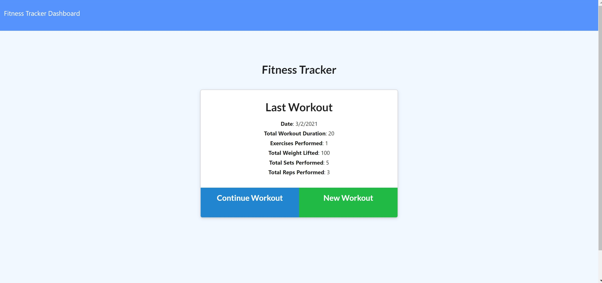
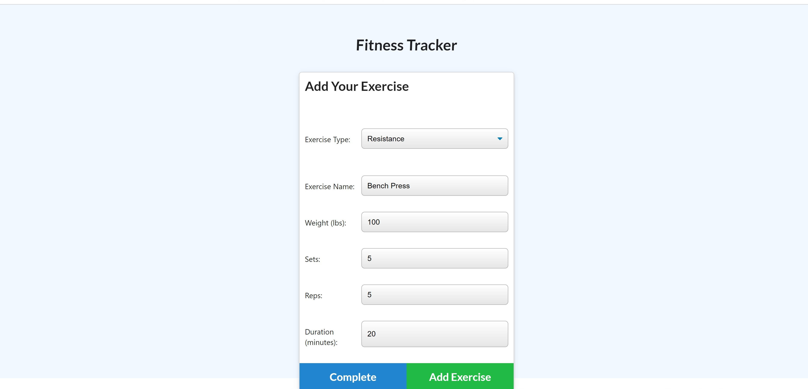
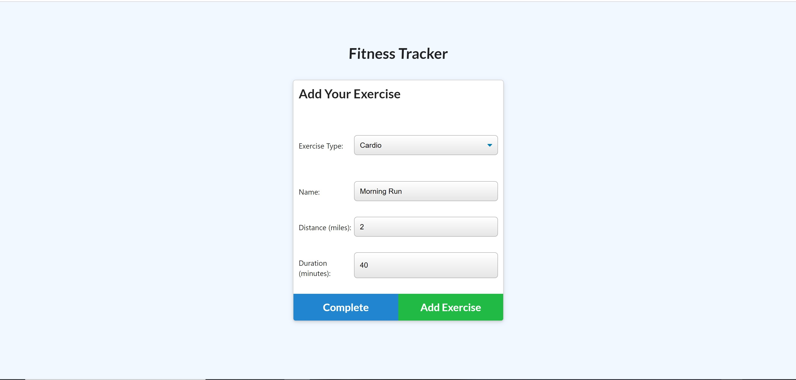
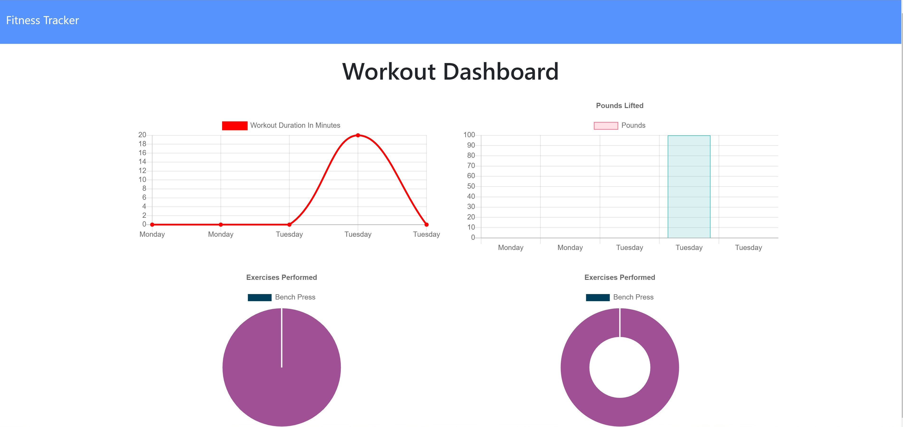

# Fitness Tracker [](https://opensource.org/licenses/MIT)

## Table of Contents
  * [Description](#Description)
  * [User Story](#User-Story)
  * [Contributors](#Contributors)
  * [Language/Technoligies Used](#Language/Technologies-Used)
  * [Mock-Up](#Mock-Up)    
  * [Repository](#Repository-Link)
  * [Questions](#Questions)


## Description 
Fitness Tracker allows the user to create, complete and keep history of workouts. The type of workout exercises can be selected to be resistance or cardio. The user can enter various characteristics such as weight, sets, reps and duration as well as distance, depending on the type of exercise chosen(resistance or cario). The workout dashboard section diplays differenct types of charts/graphs such as, line graphs, bar charts and pie charts to display trends.


## User Story
```
As A user

I WANT to be able to view create and track daily workouts. 

I WANT to be able to log multiple exercises in a workout on a given day. 

I SHOULD also be able to track the name, type, weight, sets, reps, and duration of exercise. If the exercise is a cardio exercise, I should be able to track my distance traveled.

SO THAT I can keep an organized progress of my activity
```
## Contributors
 [Janneth Alvarado Verduzco](https://github.com/jannverduzco) - janneth_verduzco@live.com


## Language/Technologies Used
* HTML
* CSS
* JavaScript
* jQuery
* NPM package(Package.json)
   * Express
   * mongoose
* Heroku (Deployment)
* ESLint (Testing code)

## Mock-Up 

### Fitness Tracker


### Resistance Exercise Input


### Cardio Exercise Input


### Dashboard Display



## Live Link (Heroku)
### 

## Repository Link
### https://github.com/jannverduzco/My-Workout-Tracker

 ## Questions
 Please contact me direclty at [janneth_verduzco@live.com](janneth_verduzco@live.com) with any questions or suggestions.